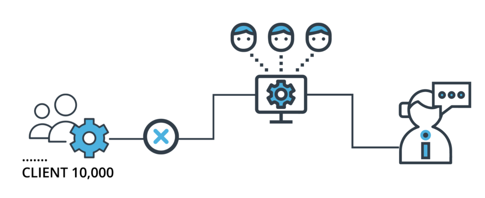

# Dynamic Risk Assessment System

## Background

Imagine that you're the Chief Data Scientist at a big company that has 10,000 corporate clients. Your company is extremely concerned about attrition risk: the risk that some of their clients will exit their contracts and decrease the company's revenue. They have a team of client managers who stay in contact with clients and try to convince them not to exit their contracts. However, the client management team is small, and they're not able to stay in close contact with all 10,000 clients.

The company needs you to create, deploy, and monitor a risk assessment ML model that will estimate the attrition risk of each of the company's 10,000 clients. If the model you create and deploy is accurate, it will enable the client managers to contact the clients with the highest risk and avoid losing clients and revenue.

Creating and deploying the model isn't the end of your work, though. Your industry is dynamic and constantly changing, and a model that was created a year or a month ago might not still be accurate today. Because of this, you need to set up regular monitoring of your model to ensure that it remains accurate and up-to-date. You'll set up processes and scripts to re-train, re-deploy, monitor, and report on your ML model, so that your company can get risk assessments that are as accurate as possible and minimize client attrition.




The third project [ML DevOps Engineer Nanodegree](https://www.udacity.com/course/machine-learning-dev-ops-engineer-nanodegree--nd0821) by Udacity. Instructions are available in udacity's [repository](https://github.com/udacity/nd0821-c3-starter-code/tree/master/starter)

## Description
Project: A Dynamic Risk Assessment System. 

## Prerequisites
- Python and Jupyter Notebook are required
- Github account to use Github Actions for CI
- Linux environment may be needed within windows through WSL2

## Dependencies
This project dependencies is available in the ```requirements.txt``` file.

## Installation
Use the package manager [pip](https://pip.pypa.io/en/stable/) to install the dependencies from the ```requirements.txt```. Its recommended to install it in a separate virtual environment.

```bash
pip install -r requirements.txt
```

## Project Structure
```bash
📦Dynamic Risk Assessment System
 ┣ 📂.dvc
 ┣ 📂.github
 ┃ ┗ 📂workflows
 ┃ ┃ ┗ 📜main.yml             # Github Action yml file
 ┣ 📂data                     # Dataset folder
 ┃ ┣ 📂ingesteddata
 ┃ ┣ 📂practicedata
 ┃ ┣ 📂sourcedata
 ┃ ┗ 📂testdata
 ┣ 📂docs      
 ┃ ┣ 📂images                 # Some images to help
 ┃ ┣ 📂metrics                # Model metrics
 ┃ ┣ 📂models                 # Trained serialized models
 ┃ ┃ ┗📂practicemodels 
 ┃ ┃ ┗📂production_deployment 
 ┣ 📂src                  
 ┃ ┣ 📂api                    # Flask API folder
 ┃ ┃ ┣ 📜app.py
 ┃ ┃ ┣ 📜apicalls.py
 ┃ ┃ ┗ 📜wsgi.py                             
 ┃ ┣ 📂pipeline                # Model pipeline architecture and train functions
 ┃ ┗ ┗📜pipeline.py            
 ┃ ┃ ┣📜ingestion.py           
 ┃ ┃ ┣📜training.py            
 ┃ ┃ ┣📜scoring.py             
 ┃ ┃ ┣📜deployment.py          
 ┃ ┃ ┣📜training_pipeline.py   
 ┃ ┃ ┣📜diagnostics.py      
 ┃ ┃ ┣📜reporting.py      
 ┃ ┃ ┣📜fullprocess.py      
 ┣📜README.md                
 ┣📜requirements.txt         # Projects required dependencies
 ┣📜cronjob.txt              # The cronjob file
 ┗📜main.py                  # The main file for this project
```
## Usage
The config file contains the paths for all files.

1- Ingestion
```bash
python main.py -p ingestion
```

2- Training
```bash
python main.py -p training
```

2- Dignostics
```bash
python main.py -p diagnostics
```

3- Reporting
```bash
python main.py -p reporting
```

3- Automation
```bash
python main.py -p automation
```

3- API
```bash
python main.py -p api
```

3- APICALLS
```bash
python src/api/apicalls.py
```

## License
Distributed under the [MIT](https://choosealicense.com/licenses/mit/) License. See ```LICENSE``` for more information.